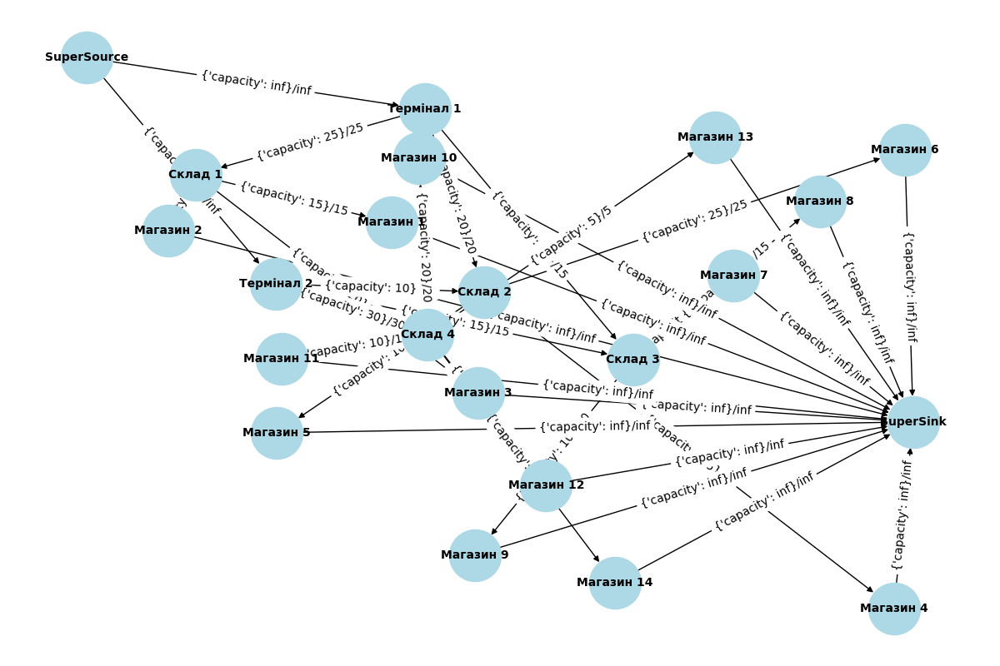

# goit-algo2-hw-03

## Task 1

Network flow analysis

Maximal flow in a network: 115

Flow distribution:

```js
{'Термінал': 'Термінал 1', 'Магазин': 'Магазин 1', 'Фактичний Потік (одиниць)': 15}
{'Термінал': 'Термінал 1', 'Магазин': 'Магазин 2', 'Фактичний Потік (одиниць)': 10}
{'Термінал': 'Термінал 1', 'Магазин': 'Магазин 4', 'Фактичний Потік (одиниць)': 15}
{'Термінал': 'Термінал 1', 'Магазин': 'Магазин 5', 'Фактичний Потік (одиниць)': 10}
{'Термінал': 'Термінал 1', 'Магазин': 'Магазин 6', 'Фактичний Потік (одиниць)': 5}
{'Термінал': 'Термінал 1', 'Магазин': 'Магазин 7', 'Фактичний Потік (одиниць)': 15}
{'Термінал': 'Термінал 1', 'Магазин': 'Магазин 8', 'Фактичний Потік (одиниць)': 10}
{'Термінал': 'Термінал 2', 'Магазин': 'Магазин 10', 'Фактичний Потік (одиниць)': 20}
{'Термінал': 'Термінал 2', 'Магазин': 'Магазин 11', 'Фактичний Потік (одиниць)': 10}
```

Unused network capacities:

```
Склад 1 -> Магазин 3: 20
Склад 2 -> Магазин 6: 20
Склад 3 -> Магазин 8: 5
Склад 3 -> Магазин 9: 10
Склад 4 -> Магазин 12: 15
Склад 4 -> Магазин 13: 5
Склад 4 -> Магазин 14: 10
```

Graph wisualization:


Optimization of the network flow: increase capacity of the warehouses 1, 2, 3, 4 according to the unused network capacities.
